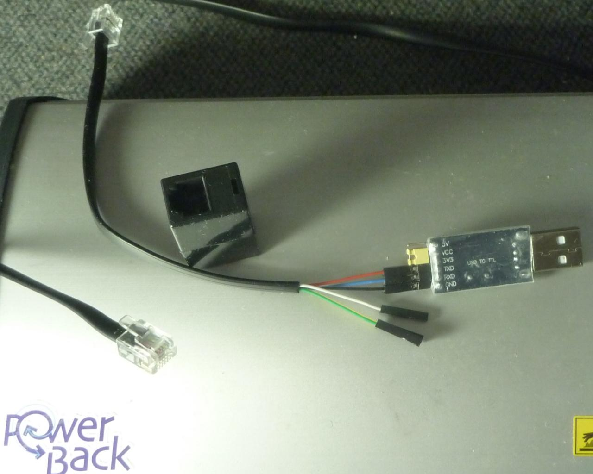
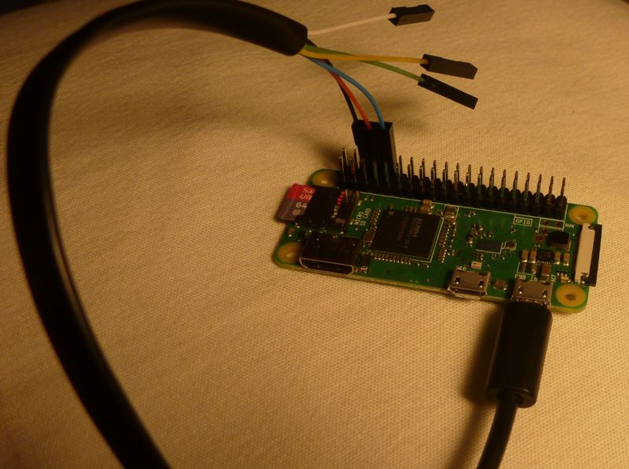

# ttyT1941
Simple demonstrator to show how to control a Tacx motor brake via a serial connection.

TACX sells the T1941 motor brake in a bundle called _FORTIUS T1940 Virtual Reality Trainer_ together with the T1942 'solid blue' head unit and some software. With this little tool you can control the T1941 without the T1942 head unit and without additional software.

# Warning

The whole project is experimental. It worked for my personal setup. There is absolutely no warranty, that this works with your brake or with your USB2TTL adapter.

Building your own USB2TTL adapter or using the software **may destroy your motor brake, your adapter or even your PC**.

It is **HIGHLY** recommended to use 3.3V TTL logic, because the brake may not be 5V tolerant!

# Protocol

Check the [Wiki](https://github.com/totalreverse/ttyT1941/wiki)!

## CREDITS

The protocol itself was not analyzed by me. It depends on work from Michel Dagenais and code written for Golden Cheetah.

# Serial Adapter

# The Cable 

<pre>
# socket (female side) how you see it, when looking on the brake-power-back (same for head unit)
#
#    __|^^^|__
#  _|         |_  original|
#  |           |  cable   | T1941: motor brake                (T1901 eddy current brake)
#  |           |  color   |
#  |6 5 4 3 2 1|  ----------------------------------------------------------------------------
#   | | | | | |__ white   | T1941: not used                   (T1901: CAD sensor)
#   | | | | |____ black   | T1941  GND                        (T1901: also GND)
#   | | | |______ red     | T1941: Brake-Rx, Host-Tx (3.3V !) (T1901: magnetic field 'PWM' switch)
#   | | |________ green   | T1941: not used                   (T1901: powerline sinus +/- 20V)
#   | |__________ yellow  | T1941: ~6V                        (T1901: >12V) (maybe to power stand-alone head units?)
#   |____________ blue    | T1941: Brake-Tx, Host-Rx (3.3v !) (T1901: wheel signal)
#
# tested with a "1$" CH341 USB to TTL adapter
#
# !!!!!!!!!!!!!!!!!!!!!!!!!!!!!!!!!!!!!!!!!!!!!!!!!!!||!!
# !!!                                                 !!!
# !!! It is HIGHLY recommended to use 3.3V TTL logic, !!!
# !!! because the brake may not be 5V tolerant.       !!!
# !!!                                                 !!!
# !!!!!!!!!!!!!!!!!!!!!!!!!!!!!!!!!!!!!!!!!!!!!!!!!!!!!!!
#
# Just wire USB/TTL-GND to RJ12-Pin 2 (black, GND), USB/TTL-Tx to RJ12-Pin 3 
# (Red, Host-Tx, Brake Rx) and USB/TTL-Rx to RJ12-Pin 6 (blue, Host-Rx, Brake Tx).
# On Raspi GND is Pin 6, Tx is Pin 8 and Rx is Pin 10. 
#
# Because I did not want to cut my original cable, I bought a new 6p6c RJ12 
# cable (1$) a CH341 USB to TTL adapter (1$).You can solder the pins or connected 
# 'Dupont' sockets (< 1$) if you have a crimp tool.
#
# From 'Makeblock' there is a cable with a RJ12/RJ25 connector, on one side and 
# Dupont sockets on the other side. Price is about 2$-3$ for a bundle with two cables. 
# The Makeblock part no. is MB14230 and they use the same wire colors as the TACX cable.
# The cable is only 20cm long, but with a full connected female-female 6p6c adapter, 
# you can use the original cable in addition, though I would recommend to use an
# (not too long) USB extension cable. The TTL line is very sensitive to noise.

</pre>

